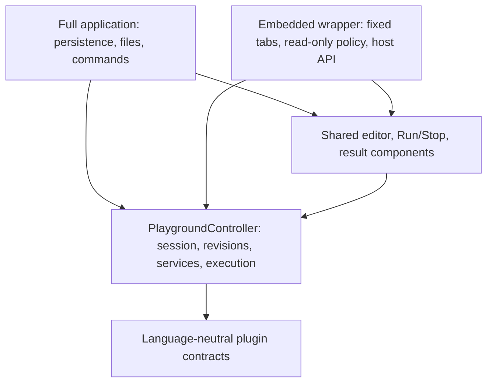

# Embedded playground API

Create an editor with a language plugin and optional initial text. No application controller, environment object, storage, or framework setup is required.

```ts
import { createEmbeddedPlayground } from '@language-playground/ide/embedded';
import '@language-playground/ide/styles.css';

const editor = createEmbeddedPlayground(container, { plugin, value: source });
editor.setValue(updatedSource);
await editor.run();
const execution = editor.getSnapshot().execution;
// When the host removes the editor:
editor.dispose();
```

`container` must be empty, connected to the current document, and have an explicit height. `plugin` implements the [language API](playground-language-integration.md#api-definitions). An optional `editor` installer adds lexical syntax; otherwise source is plain text. Semantic capabilities still come from the plugin. The embed does not load the plugin's example catalog.

## Fixed files

Use `files` instead of `value` for several tabs. Paths are validated relative workspace paths. The initial array fixes the tab order and file identities for the instance's lifetime.

```ts
const editor = createEmbeddedPlayground(container, {
  plugin,
  files: sourceFiles,
  activeFile: initialPath,
  entryFile: entryPath,
});
```

Each `EmbeddedFile` has `path`, optional `value` (default `''`), and optional `readOnly` (default `false`). All tabs are open. Users can switch tabs but cannot add, remove, rename, open, or close files. The execution entry is independent of the active tab. Running includes every file, including protected files.

Protected files reject user edits and service-provided edits. Rename and code actions touching a protected target are rejected before any target is changed. Host `setValue` and `setValues` can update protected content. `setValues` validates the whole batch before replacing any text; duplicate/unknown paths, invalid source, and exceeded workspace limits reject the batch. Existing models and undo history are retained. `setReadOnly` changes the host-owned edit policy for an existing file.

## Defaults and updates

`updateOptions` accepts the same presentation/execution settings used at creation. Omitted properties retain their current values. Invalid combinations change nothing. `getOptions` returns all resolved values, including the current page palette.

| Option                                              | Default                        | Constraint/meaning                                                                                          |
| --------------------------------------------------- | ------------------------------ | ----------------------------------------------------------------------------------------------------------- |
| `value`                                             | `''`                           | Creates one file at the language's `defaultFilePath`; mutually exclusive with `files`                       |
| `files`                                             | One blank file                 | Nonempty; all paths unique; normal workspace size/path limits apply                                         |
| `activeFile`, `entryFile`                           | First file                     | Must identify an existing file                                                                              |
| `entryPoint`                                        | Language's `defaultEntryPoint` | At most 200 UTF-16 units                                                                                    |
| `stdin`                                             | `''`                           | At most 64,000 UTF-8 bytes                                                                                  |
| `fontSize`                                          | `14`                           | Integer 11–24 CSS pixels                                                                                    |
| `tabSize`                                           | `2`                            | Integer 1–8 spaces                                                                                          |
| `wordWrap`, `minimap`                               | `false`                        | Editor display options                                                                                      |
| `lineNumbers`, `inlayHints`, `semanticHighlighting` | `true`                         | Semantic displays require service support                                                                   |
| `autoRun`                                           | `false`                        | Runs after 1,000 ms without source/entry/input changes                                                      |
| `timeout`                                           | `10`                           | Integer 1–60 seconds                                                                                        |
| `title`                                             | Language display name          | Empty string hides title text                                                                               |
| `ariaLabel`                                         | `<language name> playground`   | Nonblank region name                                                                                        |
| `breadcrumbs`                                       | `false`                        | Display the active path/language above the editor                                                           |
| `panels`                                            | `['output', 'problems']`       | Nonempty unique subset of `output`, `problems`, `input`, `inspector`, `logs`; standard display order        |
| `panel`                                             | First configured panel         | Must be included in `panels`; updating the list selects its first item if the previous selection disappears |
| `theme`                                             | Current page theme             | Built-in ID or complete palette; no local persistence                                                       |

The default view contains source tabs, the editor, Run/Stop, Output, and Problems. It has no file-management controls, workbench command palette, theme picker, downloads, or Monaco context menu. Standard editing shortcuts remain available; Ctrl/Meta+Enter runs and Shift+Escape stops while focus is inside the embed. Host `action(id)` can invoke supported Monaco editor actions.

## Host operations and events

The complete generated definitions and declaration comments are in the [formal API reference](playground-language-integration.md#api-definitions).

| Area             | Methods/data                                                                                                  |
| ---------------- | ------------------------------------------------------------------------------------------------------------- |
| Content          | `getValue(path?)`, `setValue(value, path?)`, `setValues(changes)`, `getFiles()`                               |
| Selection/policy | `getActiveFile()`, `setActiveFile(path)`, `setReadOnly(readOnly, path?)`                                      |
| Configuration    | `getOptions()`, `updateOptions(options)`                                                                      |
| Execution        | `run()`, `stop()`, `clearOutput()`, `getSnapshot().execution`                                                 |
| Analysis         | `getDiagnostics()`, `restartLanguageService()`, `clearLogs()`, `getSnapshot().service`, `.documents`, `.logs` |
| Editor           | `focus()`, `layout()`, `reveal(location)`, `action(id)`, `getEditor()`, `ready`                               |
| Events           | `onDidChangeContent`, `onDidChangeState`, `onDidError`, `onDidDispose`                                        |
| Lifetime         | `workspaceUri`, `isDisposed()`, `dispose()`                                                                   |

`getValue`/`setValue` default to the active file. `onDidChangeContent` emits one event per accepted text transaction, with changed paths, previous text, and current text. Settings, tab selection, and diagnostics do not emit content events. `onDidChangeState` observes every core transition, including streamed output. All event methods return a Monaco-style `{ dispose() }` subscription. Subscriptions end with their instance; listener exceptions are reported through the browser's error reporting and do not prevent later listeners from running.

Content, configuration, subscriptions, and execution are available immediately. `ready` resolves when Monaco and its models are installed. `focus` before readiness is deferred. `action` and `reveal` await readiness. Native Monaco access is optional:

```ts
await editor.ready;
const monacoEditor = editor.getEditor()!;
monacoEditor.setPosition({ lineNumber: 3, column: 1 });
monacoEditor.revealLineInCenter(3);
```

The playground owns native model identity, language registrations, access policy, and disposal. Use its APIs to change managed content/settings. Do not replace or dispose models through the native editor. Native selection, view-state, event, and additional presentation APIs remain available. Monaco positions are one-based; language `Location` coordinates are zero-based UTF-16 positions.

`run` captures every document, entry, and input, cancels the previous run, and opens Output when configured. Runtime failures become execution diagnostics. Stop, timeout, and output limits settle the run promise; late backend results are ignored. A backend must still terminate its own computation when signalled. Editing preserves the preceding result; compare execution revision with the current state's revision to detect staleness.

`onError` at creation and `onDidError` observe editor/provider/rendering failures, which also appear within the embed. Service startup failures appear in service state and its alert; runtime failures appear in execution state. Invalid synchronous API arguments throw to their caller. `ready` rejects on rendering failure or disposal before the editor loads. Disposal is idempotent, attempts every cleanup, and reports cleanup failures with `AggregateError`. Other handle methods reject use after disposal.

## Independent instances and page themes

Each create call owns its service, runtime invocations, unique workspace root, editor language namespace, models, undo history, cursor state, settings, subscriptions, and DOM. Identical language IDs and file names can coexist. Disposing one instance leaves the others usable. No storage or URL state is shared.

Monaco has one theme service per window. `setTheme` from `/themes`, or an instance's `updateOptions({ theme })`, changes all playground editors and controls in that window. An instance created without a theme inherits the current palette. The initial page palette is Midnight (`dark`). Daylight's ID is `light`; other IDs are returned by `getBuiltinThemes`. A custom theme is passed as a complete `PlaygroundTheme`, not registered in an application-wide catalog by the embed.

```ts
import { setTheme } from '@language-playground/ide/themes';
setTheme('graphite');
```

Monaco provides no removal API for language IDs or theme definitions. Those registration descriptors remain in its window-wide registry; disposed instances release all models, lexical/semantic providers, listeners, timers, and services.

## Shared core and application boundaries



The full application and embedded wrapper do not import each other. The full application remains a single instance with editable files, its existing explorer, import/export, checkpoints, commands, and theme selector. Read-only tab controls are available only through the embedded API. Embedded instances have no persistence, file-management workflow, or workbench commands.

`/core` also exports `PlaygroundController`, `Session`, `PlaygroundSettings`, state types, `currentDiagnostics`, `ThemeProvider`, `PlaygroundSurface`, and `RunButton` for hosts building their own React shell. A host provides a validated `Workspace`/session and a unique absolute workspace URI, owns connection/disposal, and renders the components under `ThemeProvider` in a sized host. `PlaygroundSurface` has slots/callbacks for optional tab controls; omitting them gives fixed tabs. `RunButton` is separate so a host can place it in its toolbar. The core has no storage, archive, URL, or workbench-command dependency.

The full application accepts `title` for its header and optional `documentTitle` for the browser tab. `documentTitle` is restored on disposal if the host has not changed it in the meantime. Embedded titles affect only their own header and region.

## Workspace text search

Hosts can render `WorkspaceSearchPanel` from `/core` in a sidebar or another height-constrained region under `ThemeProvider`. It takes a `Workspace` and an `onSelect(fileId, match)` callback. The callback owns navigation; the search component uses no language service, filename convention, storage, or document-URI policy.

```tsx
import { WorkspaceSearchPanel } from '@language-playground/ide/core';

<WorkspaceSearchPanel
  workspace={session.workspace}
  active={selectedTool === 'search'}
  onSelect={(fileId, match) => revealFile(fileId, match.range)}
/>;
```

The component provides literal and Unicode regexp search, case matching, whole-word matching, and collapsible results grouped by file. It includes closed editor tabs. Queries run in a worker; changing source or search options, hiding the component with `active={false}`, or unmounting it terminates obsolete work. Invalid patterns and worker failures appear inline. Result ranges use zero-based UTF-16 positions against the exact searched snapshot; stale results cannot navigate.

`active` defaults to `true`; `autoFocus` defaults to `false`. An optional `inputRef` lets host keyboard commands focus the search field without changing its value. `limit` defaults to 1,000 total matches and `timeout` to 2,000 milliseconds per worker. Truncated results and timeouts are explicit. Keep the component mounted while switching sidebar views to retain its query and options.

Non-React callers can use `searchWorkspace(workspace, query, options?)` from `/workspace`. This is a synchronous, environment-independent operation with the same matching and preview rules. It has no execution time limit; callers control isolation for user-supplied regular expressions. Full option, result, and error definitions are included in the formal API reference.
